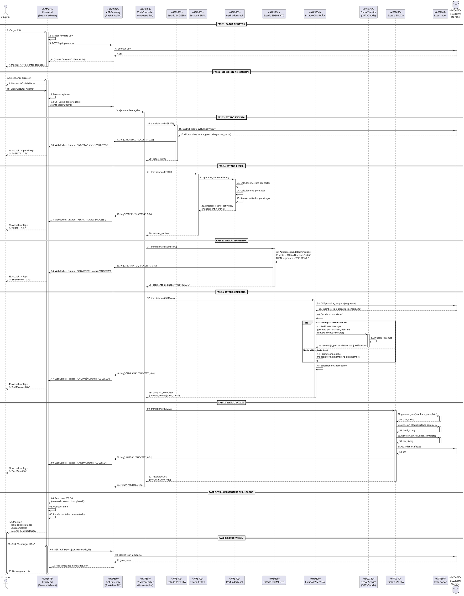
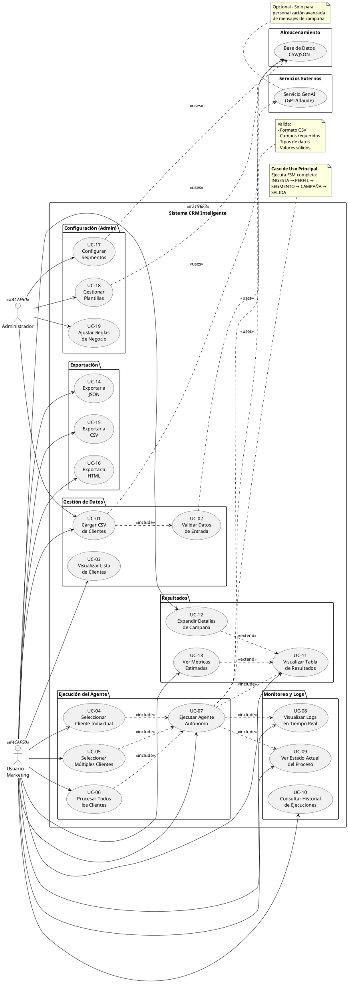
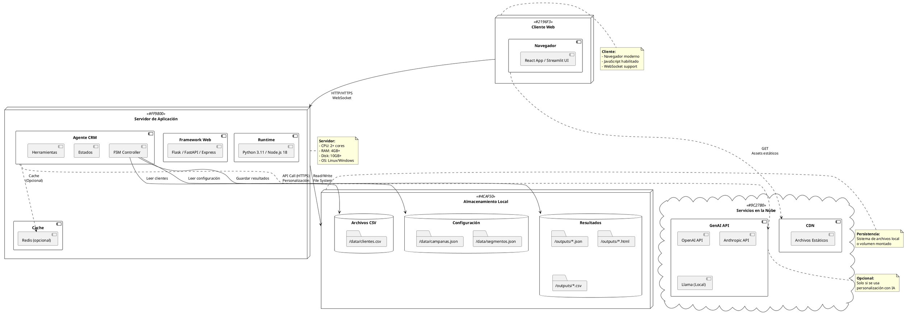
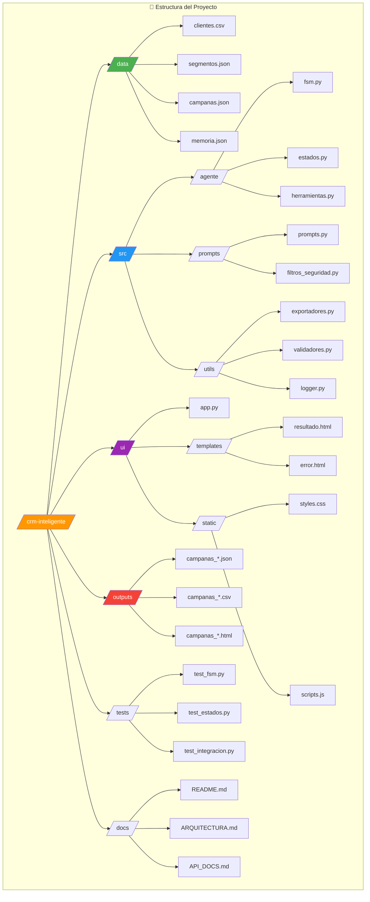
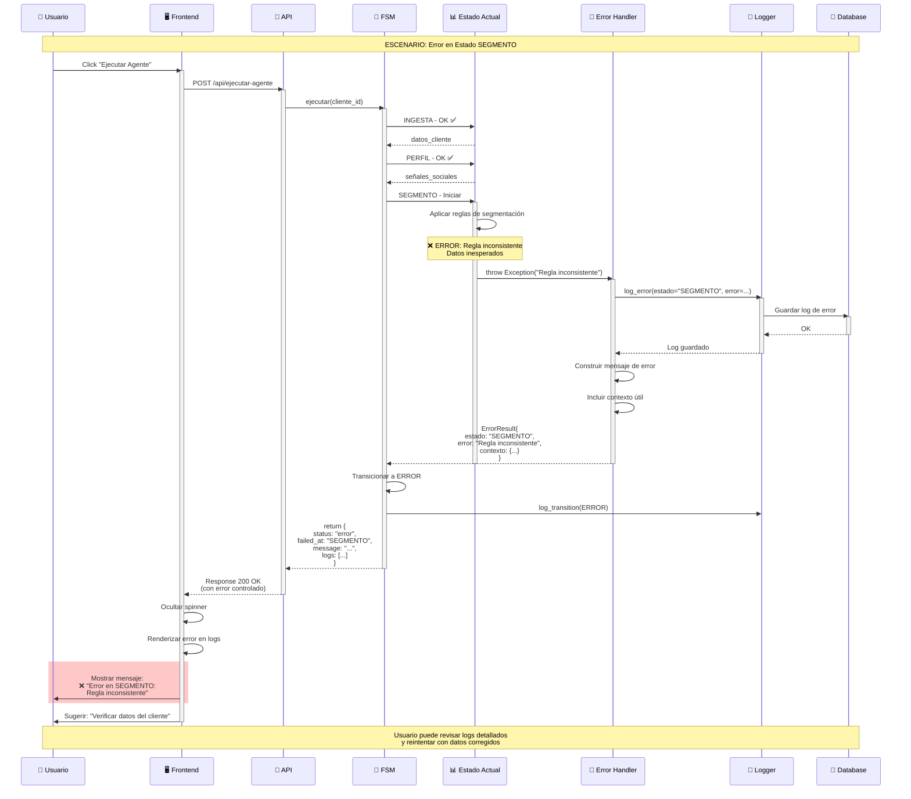

# DIAGRAMAS DE USER FLOW Y ARQUITECTURA
## CRM Inteligente - Reto 1 Hackathon NTTDATA IActiva 2025

---

## 📊 ÍNDICE DE DIAGRAMAS

1. [User Flow Completo - Interacción Usuario-Sistema](#1-user-flow-completo)
2. [Diagrama de Secuencia - Front-Back Detallado](#2-diagrama-de-secuencia-front-back)
3. [Diagrama de Arquitectura de Componentes](#3-arquitectura-de-componentes)
4. [Diagrama de Estados del Agente (FSM)](#4-diagrama-de-estados-fsm)
5. [Flujo de Datos Completo](#5-flujo-de-datos)
6. [Diagrama de Casos de Uso](#6-casos-de-uso)

---

## 1. USER FLOW COMPLETO

### Mermaid - Flujo de Usuario End-to-End

```mermaid
flowchart TD
    Start([👤 Usuario accede al sistema]) --> Upload[📤 Cargar CSV de clientes]
    Upload --> Validate{¿CSV válido?}
    
    Validate -->|❌ No| ErrorCSV[🚫 Mostrar error de formato]
    ErrorCSV --> Upload
    
    Validate -->|✅ Sí| LoadSuccess[✅ Mostrar # clientes cargados]
    LoadSuccess --> SelectMode{¿Modo de selección?}
    
    SelectMode -->|1️⃣ Un cliente| SelectOne[📋 Dropdown: Seleccionar cliente]
    SelectMode -->|🔢 Varios| SelectMulti[☑️ Checkbox: Seleccionar múltiples]
    SelectMode -->|🌐 Todos| SelectAll[✅ Marcar: Procesar todos]
    
    SelectOne --> ShowInfo[ℹ️ Mostrar info del cliente]
    SelectMulti --> ShowInfo
    SelectAll --> ShowInfo
    
    ShowInfo --> Execute{👆 Click<br/>'Ejecutar Agente'}
    
    Execute --> Loading[⏳ Mostrar spinner/loading]
    Loading --> BackendCall[🔄 Llamada al Backend API]
    
    BackendCall --> FSMExec[🤖 Ejecutar FSM del Agente]
    
    FSMExec --> LogPanel[📝 Panel de logs en tiempo real]
    LogPanel --> ShowStates[Mostrar estados:<br/>INGESTA → PERFIL → SEGMENTO<br/>→ CAMPAÑA → SALIDA]
    
    ShowStates --> CheckError{¿Error en<br/>algún estado?}
    
    CheckError -->|❌ Sí| ErrorState[🚨 Mostrar error en logs]
    ErrorState --> LogError[📋 Detalles del error]
    LogError --> End1([🔚 Proceso terminado con error])
    
    CheckError -->|✅ No| Success[✅ Proceso completado exitosamente]
    Success --> ResultsTable[📊 Tabla de resultados]
    
    ResultsTable --> ShowResults[Mostrar:<br/>Cliente | Segmento | Campaña<br/>Canal | CTA | Métricas]
    
    ShowResults --> ExpandDetails{👆 ¿Expandir<br/>detalles?}
    ExpandDetails -->|Sí| DetailView[📄 Vista detallada:<br/>Mensaje completo, logs, métricas]
    ExpandDetails -->|No| Export
    DetailView --> Export
    
    Export{📥 ¿Exportar?}
    
    Export -->|JSON| DownloadJSON[💾 Descargar .json]
    Export -->|CSV| DownloadCSV[💾 Descargar .csv]
    Export -->|HTML| DownloadHTML[💾 Descargar .html]
    Export -->|No| NewExec
    
    DownloadJSON --> NewExec{🔄 ¿Nueva ejecución?}
    DownloadCSV --> NewExec
    DownloadHTML --> NewExec
    
    NewExec -->|Sí| SelectMode
    NewExec -->|No| End2([✋ Usuario finaliza])
    
    style Start fill:#4CAF50,color:#fff
    style End1 fill:#f44336,color:#fff
    style End2 fill:#2196F3,color:#fff
    style FSMExec fill:#FF9800,color:#fff
    style Success fill:#4CAF50,color:#fff
    style ErrorState fill:#f44336,color:#fff
```

---

## 2. DIAGRAMA DE SECUENCIA FRONT-BACK

### PlantUML - Interacción Detallada Frontend ↔ Backend



---

## 3. ARQUITECTURA DE COMPONENTES

### PlantUML - Diagrama de Componentes del Sistema

```plantuml
@startuml
!define FRONTEND_COLOR #2196F3
!define BACKEND_COLOR #FF9800
!define DATA_COLOR #4CAF50
!define EXTERNAL_COLOR #9C27B0

package "CAPA DE PRESENTACIÓN" <<FRONTEND_COLOR>> {
    [UI Web] as ui
    [Selector de Clientes] as selector
    [Panel de Logs] as logs
    [Tabla de Resultados] as tabla
    [Exportador UI] as export_ui
}

package "CAPA DE API" <<BACKEND_COLOR>> {
    [API Gateway] as gateway
    [WebSocket Handler] as ws
    [Validador de Entrada] as validator
    [Controlador de Exportación] as export_ctrl
}

package "CAPA DE NEGOCIO" <<BACKEND_COLOR>> {
    package "FSM Controller" {
        [Orquestador] as fsm
        [Gestor de Estados] as state_mgr
        [Logger de Transiciones] as trans_log
    }
    
    package "Estados del Agente" {
        [Estado INGESTA] as state_ingesta
        [Estado PERFIL] as state_perfil
        [Estado SEGMENTO] as state_segmento
        [Estado CAMPAÑA] as state_campana
        [Estado SALIDA] as state_salida
        [Estado ERROR] as state_error
    }
    
    package "Herramientas" {
        [PerfiladorSocialMock] as mock
        [Motor de Segmentación] as seg_engine
        [Selector de Campaña] as camp_selector
        [Generador de Artefactos] as artifact_gen
    }
}

package "CAPA DE DATOS" <<DATA_COLOR>> {
    database "CSV Storage" as csv_db {
        [clientes.csv]
    }
    database "JSON Config" as json_db {
        [segmentos.json]
        [campanas.json]
        [memoria.json]
    }
    database "Resultados" as results_db {
        [outputs/*.json]
        [outputs/*.html]
        [outputs/*.csv]
    }
}

package "SERVICIOS EXTERNOS" <<EXTERNAL_COLOR>> {
    [GenAI API\n(GPT/Claude/Llama)] as genai
    [Sistema de Métricas\n(Simulado)] as metrics
}

' Relaciones FRONTEND -> API
ui --> gateway : HTTP POST/GET
selector --> gateway : Selección de clientes
export_ui --> export_ctrl : Solicitud de descarga
gateway --> ws : Logs en tiempo real
ws --> logs : Actualización de estado

' Relaciones API -> NEGOCIO
gateway --> validator : Validar entrada
validator --> fsm : Ejecutar agente
gateway --> export_ctrl : Preparar exportación

' Relaciones NEGOCIO - FSM
fsm --> state_mgr : Gestionar transiciones
state_mgr --> state_ingesta : Transición
state_mgr --> state_perfil : Transición
state_mgr --> state_segmento : Transición
state_mgr --> state_campana : Transición
state_mgr --> state_salida : Transición
state_mgr --> state_error : En caso de error

' Relaciones ESTADOS -> HERRAMIENTAS
state_ingesta --> csv_db : Cargar cliente
state_perfil --> mock : Generar señales
state_segmento --> seg_engine : Clasificar
state_segmento --> json_db : Leer reglas
state_campana --> camp_selector : Seleccionar plantilla
state_campana --> json_db : Leer campañas
state_campana --> genai : Personalizar mensaje (opcional)
state_salida --> artifact_gen : Generar outputs

' Relaciones HERRAMIENTAS -> DATOS
mock --> json_db : Config de señales
seg_engine --> json_db : Reglas de segmentación
camp_selector --> json_db : Plantillas
artifact_gen --> results_db : Guardar artefactos

' Relaciones NEGOCIO -> API (logs)
state_mgr --> trans_log : Registrar transición
trans_log --> ws : Enviar log en tiempo real

' Relaciones EXPORTACIÓN
export_ctrl --> results_db : Leer artefactos
export_ctrl --> export_ui : Enviar archivo

' Relaciones EXTERNOS
state_campana ..> metrics : Estimar métricas

' Notas
note right of fsm
    Orquestador central que
    controla todo el flujo
    del agente autónomo
end note

note right of genai
    Opcional - Solo para
    personalización avanzada
    de mensajes
end note

note bottom of results_db
    Almacenamiento temporal
    de resultados generados
    por el agente
end note

@enduml
```



---

## 4. DIAGRAMA DE ESTADOS (FSM)

### PlantUML - Máquina de Estados Finitos del Agente

```plantuml
@startuml
!define SUCCESS_COLOR #4CAF50
!define ERROR_COLOR #f44336
!define PROCESSING_COLOR #FF9800

[*] --> INICIO

state INICIO {
    [*] --> Inicializar
    Inicializar : Preparar contexto
    Inicializar : Cargar configuración
    Inicializar --> [*]
}

INICIO --> INGESTA : Ejecutar agente(cliente_id)

state INGESTA <<PROCESSING_COLOR>> {
    [*] --> CargarCliente
    CargarCliente : Leer CSV
    CargarCliente : Buscar id_cliente
    CargarCliente --> Validar
    Validar : Verificar campos requeridos
    Validar : Validar tipos de datos
    Validar --> [*] : Cliente válido
}

INGESTA --> ERROR : Cliente no encontrado\n❌ Error de validación

state PERFIL <<PROCESSING_COLOR>> {
    [*] --> GenerarSenales
    GenerarSenales : Llamar PerfiladorMock
    GenerarSenales : Calcular intereses por sector
    GenerarSenales --> CalcularTono
    CalcularTono : Asignar tono según gasto
    CalcularTono --> SimularActividad
    SimularActividad : Simular engagement
    SimularActividad : Definir horario activo
    SimularActividad --> [*] : Señales generadas
}

INGESTA --> PERFIL : ✅ Cliente cargado

PERFIL --> ERROR : Falla en generación\n❌ Mock error

state SEGMENTO <<PROCESSING_COLOR>> {
    [*] --> AplicarReglas
    AplicarReglas : Evaluar reglas determinísticas
    AplicarReglas : IF gasto > 800 AND sector = tech...
    AplicarReglas --> AsignarSegmento
    AsignarSegmento : Asignar segmento
    AsignarSegmento : Prioridad: primera regla que aplique
    AsignarSegmento --> [*] : Segmento asignado
    
    note right of AplicarReglas
        Reglas:
        1. PREMIUM_TECH
        2. VIP_RETAIL
        3. PREMIUM_SALUD
        4. BASICO_SALUD
        5. BASICO_EDUCACION
        6. ALTO_RIESGO
        7. GENERAL (default)
    end note
}

PERFIL --> SEGMENTO : ✅ Señales generadas

SEGMENTO --> ERROR : Segmentación fallida\n❌ Reglas inconsistentes

state CAMPAÑA <<PROCESSING_COLOR>> {
    [*] --> MapearPlantilla
    MapearPlantilla : Buscar plantilla por segmento
    MapearPlantilla --> DecidirPersonalizacion
    
    DecidirPersonalizacion : ¿Usar GenAI?
    DecidirPersonalizacion --> PersonalizarConIA : Sí
    DecidirPersonalizacion --> PersonalizarBasico : No
    
    PersonalizarConIA : Llamar API GenAI
    PersonalizarConIA : Prompt: personalizar mensaje
    PersonalizarConIA --> GenerarCTA
    
    PersonalizarBasico : Formatear plantilla
    PersonalizarBasico : Reemplazar {nombre}
    PersonalizarBasico --> GenerarCTA
    
    GenerarCTA : Asignar Call-to-Action
    GenerarCTA --> SeleccionarCanal
    SeleccionarCanal : Determinar canal óptimo
    SeleccionarCanal : Considerar red_social + segmento
    SeleccionarCanal --> [*] : Campaña completa
}

SEGMENTO --> CAMPAÑA : ✅ Segmento asignado

CAMPAÑA --> ERROR : Error en selección\n❌ Plantilla no encontrada\n❌ GenAI timeout

state SALIDA <<PROCESSING_COLOR>> {
    [*] --> GenerarJSON
    GenerarJSON : Construir objeto completo
    GenerarJSON : Incluir logs, métricas, timestamps
    GenerarJSON --> GenerarHTML
    
    GenerarHTML : Renderizar template
    GenerarHTML : Vista previa legible
    GenerarHTML --> GenerarCSV
    
    GenerarCSV : Exportar datos tabulares
    GenerarCSV : Cliente | Segmento | Campaña
    GenerarCSV --> GuardarArtefactos
    
    GuardarArtefactos : Persistir en storage
    GuardarArtefactos : Generar IDs únicos
    GuardarArtefactos --> [*] : Artefactos listos
}

CAMPAÑA --> SALIDA : ✅ Campaña generada

SALIDA --> ERROR : Error en exportación\n❌ Falla al guardar archivo

state ERROR <<ERROR_COLOR>> {
    [*] --> RegistrarError
    RegistrarError : Capturar excepción
    RegistrarError : Log de error completo
    RegistrarError --> NotificarUsuario
    NotificarUsuario : Enviar mensaje de error
    NotificarUsuario : Incluir contexto útil
    NotificarUsuario --> [*]
}

SALIDA --> FIN : ✅ Proceso completado

state FIN <<SUCCESS_COLOR>> {
    [*] --> LimpiarContexto
    LimpiarContexto : Liberar recursos
    LimpiarContexto : Guardar en memoria (opcional)
    LimpiarContexto --> [*]
}

ERROR --> FIN : Error manejado

FIN --> [*]

note right of INGESTA
    Duración típica: 0.1-0.3s
    Input: cliente_id
    Output: objeto cliente
end note

note right of PERFIL
    Duración típica: 0.3-0.6s
    Input: cliente
    Output: señales_sociales
end note

note right of SEGMENTO
    Duración típica: 0.05-0.2s
    Input: cliente + señales
    Output: segmento
end note

note right of CAMPAÑA
    Duración típica: 0.5-1.2s
    (con GenAI: +0.5-2.0s)
    Input: segmento + cliente
    Output: campaña
end note

note right of SALIDA
    Duración típica: 0.2-0.5s
    Input: campaña + contexto
    Output: JSON, HTML, CSV
end note

@enduml
```



---

## 5. FLUJO DE DATOS

### Mermaid - Diagrama de Flujo de Datos (DFD)

```mermaid
graph LR
    subgraph "USUARIO"
        U[👤 Usuario]
    end
    
    subgraph "FRONTEND"
        UI[🖥️ Interfaz Web]
        Upload[📤 Upload CSV]
        Select[📋 Selector]
        Logs[📝 Panel Logs]
        Results[📊 Resultados]
        Export[💾 Exportación]
    end
    
    subgraph "API GATEWAY"
        API[🔌 REST API]
        WS[🔄 WebSocket]
        Valid[✅ Validador]
    end
    
    subgraph "FSM CONTROLLER"
        FSM[🤖 Orquestador]
        SM[⚙️ State Manager]
    end
    
    subgraph "ESTADOS"
        S1[1️⃣ INGESTA]
        S2[2️⃣ PERFIL]
        S3[3️⃣ SEGMENTO]
        S4[4️⃣ CAMPAÑA]
        S5[5️⃣ SALIDA]
    end
    
    subgraph "HERRAMIENTAS"
        Mock[🎭 PerfiladorMock]
        SegE[🎯 Segmentador]
        CampS[📢 Selector Campaña]
        ArtG[📄 Generador Artefactos]
    end
    
    subgraph "GENAI"
        GenAI[🧠 GPT/Claude API]
    end
    
    subgraph "DATOS"
        CSV[(📊 clientes.csv)]
        JSON[(📋 config.json)]
        OUT[(📁 outputs/)]
    end
    
    %% Flujo de carga
    U -->|1. Sube CSV| Upload
    Upload -->|2. Archivo| API
    API -->|3. Valida| Valid
    Valid -->|4. Guarda| CSV
    CSV -->|5. Confirmación| API
    API -->|6. Status| UI
    UI -->|7. Muestra| U
    
    %% Flujo de selección
    U -->|8. Selecciona cliente| Select
    Select -->|9. IDs| API
    
    %% Flujo de ejecución
    API -->|10. Ejecutar| FSM
    FSM -->|11. Coordina| SM
    
    %% Estado INGESTA
    SM -->|12. Activa| S1
    S1 -->|13. Lee| CSV
    CSV -->|14. Datos cliente| S1
    S1 -->|15. Log| WS
    WS -->|16. Actualiza| Logs
    
    %% Estado PERFIL
    S1 -->|17. Datos| S2
    S2 -->|18. Genera| Mock
    Mock -->|19. Usa config| JSON
    Mock -->|20. Señales| S2
    S2 -->|21. Log| WS
    
    %% Estado SEGMENTO
    S2 -->|22. Cliente+Señales| S3
    S3 -->|23. Clasifica| SegE
    SegE -->|24. Lee reglas| JSON
    SegE -->|25. Segmento| S3
    S3 -->|26. Log| WS
    
    %% Estado CAMPAÑA
    S3 -->|27. Segmento| S4
    S4 -->|28. Selecciona| CampS
    CampS -->|29. Lee plantillas| JSON
    CampS -->|30. Plantilla| S4
    S4 -.->|31. Personaliza (opcional)| GenAI
    GenAI -.->|32. Mensaje| S4
    S4 -->|33. Log| WS
    
    %% Estado SALIDA
    S4 -->|34. Campaña| S5
    S5 -->|35. Genera| ArtG
    ArtG -->|36. Crea JSON| OUT
    ArtG -->|37. Crea HTML| OUT
    ArtG -->|38. Crea CSV| OUT
    OUT -->|39. Artefactos| S5
    S5 -->|40. Log| WS
    
    %% Retorno de resultados
    S5 -->|41. Resultado| FSM
    FSM -->|42. Response| API
    API -->|43. Datos| Results
    Results -->|44. Muestra| U
    
    %% Exportación
    U -->|45. Descarga| Export
    Export -->|46. Solicita| API
    API -->|47. Lee| OUT
    OUT -->|48. Archivo| Export
    Export -->|49. Descarga| U
    
    %% Estilos
    style U fill:#4CAF50,color:#fff
    style FSM fill:#FF9800,color:#fff
    style GenAI fill:#9C27B0,color:#fff
    style CSV fill:#2196F3,color:#fff
    style JSON fill:#2196F3,color:#fff
    style OUT fill:#2196F3,color:#fff
```

---

## 6. CASOS DE USO

### PlantUML - Diagrama de Casos de Uso



---

## 7. DIAGRAMA DE DESPLIEGUE

### PlantUML - Arquitectura de Despliegue



---

## 8. ARQUITECTURA DE INFORMACIÓN

### Mermaid - Estructura de Información



---

## 9. DIAGRAMA DE TIEMPO (TIMING)

### Mermaid - Secuencia Temporal de Ejecución

```mermaid
gantt
    title Timeline de Ejecución del Agente CRM (Cliente Individual)
    dateFormat SSS
    axisFormat %L ms
    
    section Frontend
    Usuario carga CSV           :done, ui1, 000, 100ms
    Usuario selecciona cliente  :done, ui2, after ui1, 50ms
    Click "Ejecutar Agente"     :crit, ui3, after ui2, 10ms
    Mostrar spinner             :active, ui4, after ui3, 10ms
    Actualizar logs INGESTA     :ui5, 220, 10ms
    Actualizar logs PERFIL      :ui6, 520, 10ms
    Actualizar logs SEGMENTO    :ui7, 640, 10ms
    Actualizar logs CAMPAÑA     :ui8, 1440, 10ms
    Actualizar logs SALIDA      :ui9, 1740, 10ms
    Renderizar resultados       :done, ui10, 2040, 100ms
    
    section Backend API
    Recibir request             :crit, api1, 160, 20ms
    Validar entrada             :api2, after api1, 30ms
    Llamar FSM Controller       :api3, after api2, 10ms
    Enviar logs vía WebSocket   :api4, 220, 1520ms
    Retornar resultado final    :done, api5, 2040, 20ms
    
    section FSM Estados
    INGESTA - Cargar cliente    :fsm1, 210, 200ms
    PERFIL - Generar señales    :fsm2, 410, 300ms
    SEGMENTO - Clasificar       :fsm3, 710, 100ms
    CAMPAÑA - Seleccionar       :fsm4, 810, 800ms
    SALIDA - Generar artefactos :fsm5, 1610, 300ms
    
    section GenAI (Opcional)
    Llamada API personalización :genai1, 850, 600ms
    Espera respuesta            :genai2, after genai1, 400ms
    Procesar respuesta          :genai3, after genai2, 50ms
    
    section Storage
    Leer CSV de clientes        :storage1, 220, 50ms
    Leer JSON de configuración  :storage2, 820, 30ms
    Guardar artefactos          :storage3, 1850, 100ms
```

---

## 10. DIAGRAMA DE INTERACCIÓN - ERROR HANDLING

### Mermaid - Manejo de Errores



---

## 11. DIAGRAMA DE CONTEXTO - SISTEMA COMPLETO

### Mermaid - Diagrama de Contexto

```mermaid
graph TB
    subgraph "ACTORES EXTERNOS"
        U1[👤 Usuario Marketing]
        U2[👤 Administrador]
        U3[👤 Analista de Datos]
    end
    
    subgraph "SISTEMA CRM INTELIGENTE"
        CORE[🤖 AGENTE AUTÓNOMO<br/>Orquestador FSM]
    end
    
    subgraph "SISTEMAS EXTERNOS"
        GENAI[🧠 GenAI APIs<br/>GPT/Claude/Llama]
        ANALYTICS[📊 Sistema de Analytics<br/>Mock/Simulado]
    end
    
    subgraph "ALMACENAMIENTO"
        DB1[(📊 CSV Storage<br/>Datos de Clientes)]
        DB2[(📋 JSON Config<br/>Segmentos y Campañas)]
        DB3[(📁 Results Storage<br/>Artefactos Generados)]
    end
    
    subgraph "INTEGRACIONES FUTURAS"
        CRM[💼 CRM Externo<br/>Salesforce/HubSpot]
        EMAIL[📧 Email Service<br/>SendGrid/SES]
        SOCIAL[📱 Social Media APIs<br/>Meta/LinkedIn]
    end
    
    %% Relaciones Usuarios -> Sistema
    U1 -->|Carga clientes<br/>Ejecuta agente<br/>Descarga resultados| CORE
    U2 -->|Configura segmentos<br/>Gestiona plantillas<br/>Define reglas| CORE
    U3 -->|Consulta logs<br/>Exporta datos<br/>Analiza métricas| CORE
    
    %% Relaciones Sistema -> Almacenamiento
    CORE -->|Lee clientes| DB1
    CORE -->|Lee configuración| DB2
    CORE -->|Escribe resultados| DB3
    
    %% Relaciones Sistema -> Externos
    CORE -.->|Personalización<br/>de mensajes<br/>(Opcional)| GENAI
    CORE -.->|Estimación<br/>de métricas<br/>(Simulado)| ANALYTICS
    
    %% Relaciones Sistema -> Integraciones Futuras
    CORE -.->|Sincronización<br/>de clientes<br/>(Futuro)| CRM
    CORE -.->|Envío de<br/>campañas<br/>(Futuro)| EMAIL
    CORE -.->|Publicación<br/>en redes<br/>(Futuro)| SOCIAL
    
    %% Estilos
    style CORE fill:#FF9800,color:#fff,stroke:#333,stroke-width:4px
    style U1 fill:#4CAF50,color:#fff
    style U2 fill:#4CAF50,color:#fff
    style U3 fill:#4CAF50,color:#fff
    style GENAI fill:#9C27B0,color:#fff
    style DB1 fill:#2196F3,color:#fff
    style DB2 fill:#2196F3,color:#fff
    style DB3 fill:#2196F3,color:#fff
    
    classDef futuro fill:#ccc,stroke:#666,stroke-dasharray: 5 5
    class CRM,EMAIL,SOCIAL futuro
```

---

## 📝 RESUMEN DE INTERACCIONES CLAVE

### Front-End → Back-End

| Endpoint | Método | Payload | Respuesta |
|----------|--------|---------|-----------|
| `/api/upload-csv` | POST | FormData(file) | `{status, clientes_count}` |
| `/api/clientes` | GET | - | `[{id, nombre, sector, ...}]` |
| `/api/ejecutar-agente` | POST | `{cliente_ids: [...]}` | `{status, resultados, logs}` |
| `/api/export/json/{id}` | GET | - | File: `campanas.json` |
| `/api/export/csv/{id}` | GET | - | File: `campanas.csv` |
| `/api/export/html/{id}` | GET | - | File: `campanas.html` |

### WebSocket Events (Real-time)

| Event | Dirección | Payload | Propósito |
|-------|-----------|---------|-----------|
| `log_update` | Server → Client | `{estado, status, timestamp, duration}` | Actualizar panel de logs |
| `estado_change` | Server → Client | `{estado_anterior, estado_nuevo}` | Indicar transición de estado |
| `error_occurred` | Server → Client | `{estado, error, mensaje}` | Notificar error en tiempo real |
| `proceso_completo` | Server → Client | `{resultado, duration_total}` | Finalización exitosa |

### FSM → Estados (Llamadas Internas)

| Estado | Input | Output | Duración Típica |
|--------|-------|--------|-----------------|
| INGESTA | `id_cliente` | `objeto_cliente` | 0.1-0.3s |
| PERFIL | `cliente` | `señales_sociales` | 0.3-0.6s |
| SEGMENTO | `cliente, señales` | `segmento_asignado` | 0.05-0.2s |
| CAMPAÑA | `segmento, cliente` | `campaña_completa` | 0.5-1.2s (+GenAI) |
| SALIDA | `campaña, contexto` | `{json, html, csv}` | 0.2-0.5s |

---

## 🎯 PUNTOS CRÍTICOS DE INTEGRACIÓN

### 1. WebSocket para Logs en Tiempo Real
```javascript
// Frontend (JavaScript)
const ws = new WebSocket('ws://localhost:8000/ws');

ws.onmessage = (event) => {
    const data = JSON.parse(event.data);
    updateLogPanel(data.estado, data.status, data.timestamp);
};
```

### 2. Llamada a GenAI (Opcional)
```python
# Backend (Python)
async def personalizar_mensaje(plantilla, cliente, senales):
    response = await genai_client.messages.create(
        model="claude-sonnet-4",
        max_tokens=500,
        messages=[{
            "role": "user",
            "content": construir_prompt(plantilla, cliente, senales)
        }]
    )
    return response.content[0].text
```

### 3. Persistencia de Resultados
```python
# Backend (Python)
def guardar_resultado(resultado):
    timestamp = datetime.now().strftime("%Y%m%d_%H%M%S")
    
    # JSON
    with open(f"outputs/campanas_{timestamp}.json", "w") as f:
        json.dump(resultado, f, indent=2)
    
    # HTML
    html = renderizar_template(resultado)
    with open(f"outputs/campanas_{timestamp}.html", "w") as f:
        f.write(html)
    
    # CSV
    df = pd.DataFrame([resultado])
    df.to_csv(f"outputs/campanas_{timestamp}.csv", index=False)
```

---

## 📚 REFERENCIAS Y HERRAMIENTAS

### Visualización de Diagramas
- **PlantUML:** https://plantuml.com/
- **Mermaid Live Editor:** https://mermaid.live/
- **PlantText:** https://www.planttext.com/

### Documentación
- **Mermaid Docs:** https://mermaid.js.org/
- **PlantUML Guide:** https://plantuml.com/guide

---

**FIN DEL DOCUMENTO - DIAGRAMAS COMPLETOS** ✅

*Todos los diagramas están listos para ser copiados y renderizados en herramientas compatibles con PlantUML y Mermaid.*
